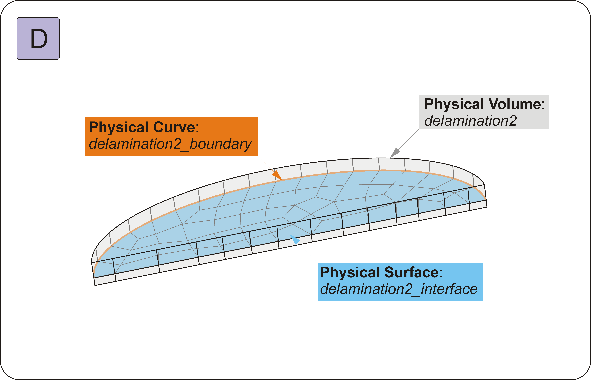
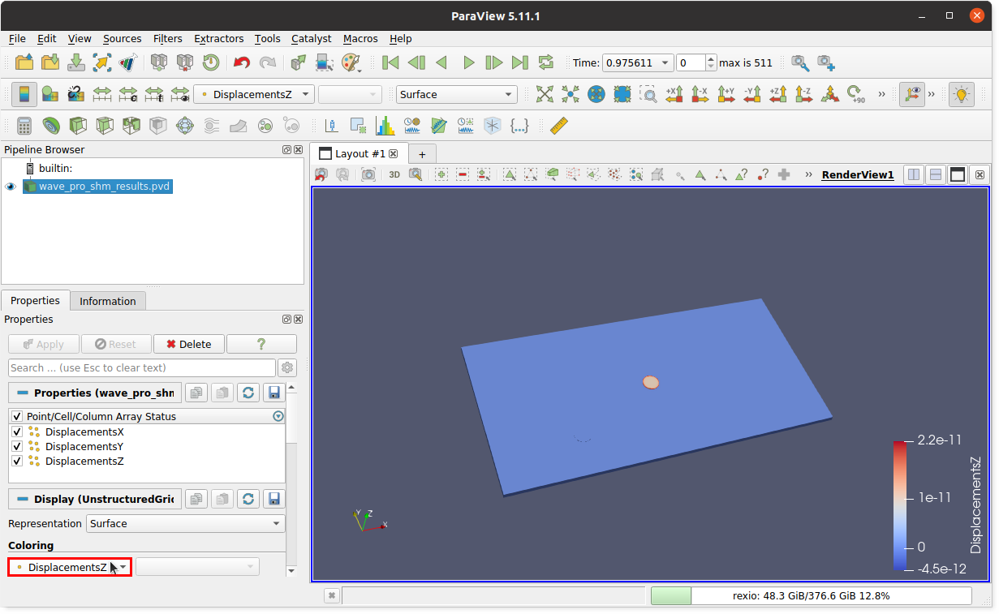

.. _Manual:

Manual
****************

The first steps with **WaveProSHM** are best to be done by following examples which can be found in:

* Linux system:

.. code:: bash

   /home/username/MATLAB Add-Ons/Apps/WaveProSHM/examples/
	
* Windows system:

.. code:: console
  
   C:\Users\Username\AppData\Roaming\Works\MATLAB Add-Ons\Apps\WaveProSHM\examples\

Examples consists of:
	
  * ``gmsh_geo`` folder which contains two files with examples of geometries used to produce meshes in `GMSH <https://gmsh.info/>`_ software.
  * ``inputs`` folder which contains two files with examples of inputs which are structures saved in .mat files.
  
..
  * ``gmsh_out`` folder which stores .msh mesh exported from `GMSH <https://gmsh.info/>`_
  * ``mesh`` folder which contains two meshes converted form `GMSH <https://gmsh.info/>`_ msh format to spectral element method meshes saved as .mat files.

.. _Mesh preparation in GMSH:     

Mesh preparation in GMSH
========================
Mesh can be prepared directly in the graphical user interface of `GMSH <https://gmsh.info/>`_ but using input file with .geo extension enables more automated process of mesh generation. 
Please refer to examples of .geo files located in ``gmsh_geo`` folder.

Physical groups and names
-------------------------

The crucial part of the mesh preparation is adding description in the form of **Physical Names** on which **WaveProSHM** relies on in opposite to **Physical Tags** (numbers).
All **Physical Groups** and corresponding **Physical Names** defined in the mesh are available in `GMSH <https://gmsh.info/>`_ under *Tools* :math:`\rightarrow` *Visibility*.
In particular, for ``simple_plate_delam_order_3.geo`` example below the following **Physical Groups** can be distinguished:

* **Physical Volume**,
* **Physical Surface**,
* **Physical Curve**,
* **Physical Point**.

Each of them has unique **Physical Tag** (number in the second column of the table) and **Physical Name** (third column of the table), e.g. **Physical Volume** number 1 has **Physical Name**: *plate*. The corresponding code in the .geo file of this definition is in line no 128: ::

  Physical Volume("plate") = {plate_vol_below[1],plate_vol_above[1],underpzt1_vol_below[1],underpzt1_vol_above[1],underpzt2_vol_below[1],underpzt2_vol_above[1]}; 
  
  
It means that in order to have a mesh compatible with **WaveProSHM** you have to create at least one transducer characterized by: **Physical Volume** and **Physical Surfaces** corresponding to positive and negative electrodes.
More details are given in the following section.

Conforming mesh
---------------
The mesh must be prepared so that it conforms to the geometry of piezoelectric transducers (actuators and sensors), introduced cracks and delaminations.
Note that other approaches are possible for damage modelling in which damage geometry is independent of underlying mesh :cite:p:`Nicoli2023`. However, for simplicity of the implementation, these are not considered in the version 1.0.0 of the **WaveProSHM**. 

The typical case scenario of a structure with:

* **A** piezoelectric transducer,
* **B** through-thickness crack,
* **C** delamination in between plate layers,
* **D** delamination extending to the plate edge,

is shown below:

  
Note that conforming volumes are shown for all of these cases.

A mesh of a piezoelectric transducer in the form of a disk is shown in Figure **A**.
As mentioned before, to properly characterize piezoelectric transducer the following **Physcal Groups** must be defined:

* **Physical Volume** which in this case has a **Physical Name**: *pzt1*;
* **Physical Surface** corresponding to a positive electrode (**Physical Name**: *pzt1_electrode_plus*); It is usually top, free surface of the piezoelectric transducer where voltage is applied;
* **Physical Surface** corresponding to a negative electrode (**Physical Name**: *pzt1_electrode_minus*); It is usually bottom surface of the piezoelectric transducer attached to the stucture considered as grounded (0 [V]);

An exemplary mesh for a through-thickness crack is shown in Figure **B**.
To properly characterize the through-thickness crack the following **Physcal Groups** must be defined:

* **Physical Volume** which in this case has a **Physical Name**: *crack*; It consists of all elements adjacent to the crack interface;
* **Physical Surface** corresponding to the crack interface (**Physical Name**: *crack_interface*);
* **Physical Lines** or **Physical Curves** corresponding to the crack boundary which *does not open* (**Physical Name**: *crack_boundary*).

.. Note::
   **WaveProSHM** automatially splits nodes of elements at the crack or delamination interface and introduces double nodes.
   Zero-gap is currently implemented and penetration of nodes is allowed. 
   The contat at the interface as well as an initial gap setting could be possible in future. 
   
The exemplary mesh for an embedded delamination is shown in Figure **C**.
To properly characterize the embedded delamination the following **Physcal Groups** must be defined:

* **Physical Volume** which in this case has a **Physical Name**: *delamination1*; It consists of all elements adjacent to the delamination interface;
* **Physical Surface** corresponding to the delamination interface (**Physical Name**: *delamination1_interface*);
* **Physical Curve** corresponding to the delamination boundary which *does not open* (**Physical Name**: *delamination1_boundary*).
  

  
The exemplary mesh for a delamination extending to the edge of the plate is shown in Figure **D**.
It is a different case than the one presented in Figure **C** because the delamination can open at the edge of the plate.
Therefore, the **Physical Curve** corresponding to the delamination boundary which *does not open* (**Physical Name**: *delamination2_boundary*) consist of only a half-ellipse excluding the plate edge.
**Physical Volume** (**Physical Name**: *delamination2*) and **Physical Surface** corresponding to the delamination interface (**Physical Name**: *delamination2_interface*) are defined in the same way as for previous delamination.   

WaveProSHM graphical user interface
===================================
The graphical user interface is organized by tabs and the best way is to go through them one by one.
Apart from that there are ``Load`` and ``Save`` menu which enable to load and save current state of the app.
Also the name of current file is displayed in blue colour. 
It will change into red colour if you made any changes to remind you to save the current status.

If you want to check ``examples``, simply push ``Load`` go to ``inputs`` in the install directory mentioned in `Manual`_ and select a file.
Then, proceed to `Processing`_ to read how to run selected example.
Alternatively, load exemplary mesh from ``gmsh_out`` folder from the install directory mentioned in `Manual`_ to `GMSH <https://gmsh.info/>`_ and export generated mesh to .msh format. 
Next, load mesh to **WaveProSHM** by using ``Load Mesh`` button -- follow instructions below.

.. note::

   Exemplary meshes were prepared in [mm].

Loading mesh
-------------
When you run **WaveProSHM** you will be greeted with quite a blank window with the ``Mesh`` tab open.

You have the option to choose units in which you prepared the mesh in `GMSH <https://gmsh.info/>`_.
All parameters in **WaveProSHM** are implemented by using SI units, therefore if the mesh is prepared in [mm] it will be automatically converted to [m].
Push ``Load Mesh`` button to open dialog box that lists files in the current folder. 
It enables to select or enter the name of a file.
Select .msh file.
By default, to keep files orginized, **WaveProSHM** in the current MATLAB directory creates subfolders ``gmsh_out\msh`` and ``inputs``.

The information box alongside the ``Load Mesh`` button will inform about the status of mesh loading.
Depending on the size of the mesh, this operation may take a while because .msh file is parsed line by line.
 
.. _Damage interface selection:

Damage interface selection
--------------------------
If mesh is succesfully loaded, the table will apppear. 
The first column represents **ID** whereas the second column **PhysicalSurfaceName** of surfaces which were defined in `GMSH <https://gmsh.info/>`_.
Please note that **WaveProSHM** rely on **PhysicalNames** rather than **IDs** or **Physical Tags** and will not work if these names are not defined.
Such design choice was dictated by the fact, that it is more user friendly to refer to descriptive names rather than numbers. 
Consequently, the table can be filled even without displaying the mesh.

  
If you don't want to embed any damage into the structure, proceed to `Mesh conversion`_ step without altering the table.
Otherwise, tick box or boxes in the third colum which correspond to damage interfaces.
Note that all defined physical surface names are listed in the second colum  and it is necessary to select only surfaces related to damage interfaces.
An undefined fields in a row in which selection was made will turn into dropdown menus which are indicatd by blue fonts.
The dropdown menu is not obvious, a cell in the table must be clicked to show it off.
According to description given in `Mesh preparation in GMSH`_, the damage is defined by an interface, volume and interface bundary which does not open.
Therefore, you have to select appropriate **PhysicalVolumeName** (in the example above it is *delamination*) and **PhysicalLineName** (in the example above it is still not correctly assigned).

.. _Mesh conversion:    

Mesh conversion
---------------
Mesh conversion is done via ``Convert Mesh`` button.
Mesh conversion procedure is responsible for splitting nodes at defined damage interaces (if any).
Essentially nodes are duplicated.
Currently, zero-gap at interfaces is implemented and penetration of nodes is allowed. 
But in future version it will be possible to define initial gap and enforce contact.
Moreover, conversion means that spatially uniform distribution of nodes which outputs `GMSH <https://gmsh.info/>`_ is changed into new nodal base defined by Gauss-Lobatto-Legendre nodes distribution.

 
When the ``Convert Mesh`` button is pushed and the operation is successful, the table is greyed out and it is no longer possible to make changes in the table.
You have to load mesh again if you made a mistake.
If the information box displays *Done. Mesh Converted. Materials can be assigned* you can proceed to ``Materials tab``. 

Materials
---------
Inputs related to material properties are gathered under ``Materials`` tab.
Three predefined materials are included as default in **WaveProSHM** for your convenience. 

.. note::

   Default isotropic aluminium material, orthotropic CFRP material and piezoelectric material cannot be removed by using ``- Remove Material`` button.
   
Besides, you are free to create your materials by using ``+ Add Material`` button.
The category of the added material will depend on the highlighted selection in the material tree.

.. _Isotropic material:

Isotropic material
------------------

Isotropic material is defined by mechanical properties: Young's mouduls :math:`E`, Poisson ratio :math:`\nu` and density :math:`\rho`.
However, **WaveProSHM** also allows to define three independent damping coefficients in respect to global (x,y,z) coordinate system which can be denoted by  :math:`\alpha_x, \alpha_y, \alpha_z`. 
The independence of damping coefficients allow to set them differently e.g. for in-plane (x,y) and out-of-plane (z) directions which enables (to some extend) tweaking amplitudes of excited S0 (in-plane dominant) and A0 (out-of-plane dominant) modes. Please refer to :cite:p:`Wandowski2017,Wandowski2019` for more details and implications of such approach. It can be especially useful for `Orthotropic material`_.

Effectively, in the current implementation the damping matrix is proportional to mass matrix and is defined as:

.. math::

   \mathbf{C} =
   \begin{bmatrix}
   \alpha_x M_{11} &               0 &               0 & 0      & \cdots &               \cdots &               \cdots &           \cdots \\
                 0 & \alpha_y M_{22} &               0 & 0      & \cdots &               \cdots &               \cdots &           \cdots \\
                 0 &               0 & \alpha_z M_{33} & 0      & \cdots &               \cdots &               \cdots &           \cdots \\
                 0 &               0 &              0  & \ddots & \cdots &               \cdots &               \cdots &           \cdots \\ 
            \vdots &          \vdots &          \vdots & \vdots & \ddots &                    0 &                    0 &                0 \\  
            \vdots &          \vdots &          \vdots & \vdots &      0 & \alpha_x M_{n-2,n-2} &                    0 &                0 \\
            \vdots &          \vdots &          \vdots & \vdots &      0 &                    0 & \alpha_y M_{n-1,n-1} &                0 \\ 
            \vdots &          \vdots &          \vdots & \vdots &      0 &                    0 &                    0 & \alpha_z M_{n,n}               
   \end{bmatrix}

where *n* is the is the number of nodes.

Note that any edits in mechanical material properties triggers recalculation of the corresponding elasticity matrix.

  
.. _Orthotropic material:

Orthotropic material
--------------------
Orthotropic material is defined directly by components of the elasticity matrix, density and damping coefficients.
The input for the elasticity matrix is in Voigt notation.
The included constitutive equation for stress-strain relation should be self-explanatory.

The definition of damping coefficients is the same as for the case of `Isotropic material`_.

Piezoelectric material
----------------------
Piezoelectric material properties involve many parameters which can be difficult to obtain.
For simplicity of computations, the input in **WaveProSHM** is simplified to indispensable parameters only which usually can be found in manufacturers' datasheets.
Also the convention of symbols is kept the same as in typical datasheets.
Please refer to :cite:p:`Deraemaeker2007,Rusu2020,efunda` for more details about piezoelectric material definitions and dependency of parameters.

The definition of damping coefficients is the same as for the case of `Isotropic material`_.

  
Material assignment
-------------------

Material assignment is performed in similar way as in `Damage interface selection`_.
In the first column are listed **IDs** and in the second column corresponding **PhysicalVolumeNames**. 
The third column **MaterialSelection** is composed of dropdown menus for which desired material must be selected.
The cell of the table have to be clicked in order to display dropdown menu.
Assign materials carefully, otherwise the results can be unexpected.

In the screenshot below, *CFRP* material was assigned to *plate*, *my_PZT* material to *pzt1* and *my_PZT* material is being selected from the dropdown menu to be assign to *pzt2*.

  
Transducers
-----------
Transducers, i.e. actuators and sensors have to be assigned under ``Transducers`` tab.
It is straightforward process similar to `Damage interface selection`_.

Transducers are defined by volume (*PhysicalVolume*), positive electrode (*PhysicalSurface*) and negative electrode (*PhysicalSurface*).
**PhysicalVolumeNames** are listed in the second column. 
Tick boxes for volumes you want to assign as actuators (the first table) and sensors (the second table).
An undefined fields in a row in which selection was made will turn into dropdown menus which are indicatd by blue fonts.
You have to select corresponding **PlusElectrodeSurface** and **MinusElectrodeSurface**, e.g. positive and negative electrodes.
Please be careful not to mix electrodes and assign them to appropriate volumes.

In the screenshot below, *pzt1* have been selected as actuator and *pzt2* as sensor.
*pzt1* has assigned *pzt1_electrode_plus* and *pzt1_electrode_plus* as positive and negative electrodes.
*pzt2* has assigned *pzt2_electrode_plus* as positive electrode.
*pzt2_electrode_minus* is being selected from the dropdown menu to be assign to *pzt2*.

   

Signals
-------
Excitation signals can be defined in ``Signals`` tab.
The current implementation of **WaveProSHM** is limited to Hann windowed sine excitation signals.
These type of signals are very popular in the field of SHM.
However, other types of signals will be implemented in future in the graphical user interface.

Edits of any field defining the signal will result in updating figures representing the signal in the time domain and the frequency domain.
Also changes to the *Number of Samples* will result in changes to the :math:`\Delta t` and vice versa.

Note that small square dots in the time domain signal represent time frames.

You can use ``+ Duplicate signal`` and ``- Remove signal`` to create a new signal or remove an existing signal, respectively.

By default, the first signal is assigned to all actuators.
In the screenshot below, only *pzt1* is listed in the excitation assignment table. *HannSignal2* is being assigned to *pzt1* actuator by selection in the dropdown menu.

Note that signals can be assigned to each actuator individually.
For example separate signals can be defined with different time delays to simulate phased arrays. 

 

   
.. tip ::

   An excessive number of frames can result in a very large amount of data generated by **WaveProSHM**.
   
   
.. _Processing:
  
Processing  
-------------- 

``Processing`` tab is where all the magic is happening.

*Processing unit*

First of all, select the processing unit which you want to use for computation.
CUDA compatible GPU is selected by default if it is detected in your system.
Otherwise, CPU is assigned as the processing unit.
There maybe more than one GPU available in your system and by default the first indexed GPU is selected.
Select GPU index accordingly. 
The name of the current GPU will appear in the information box when GPU reloading is completed.

*Parameters to save*

Two types of paramters to save can be distinguished: the time domain signals registered at selected points and frames which consist of full wavefield data registered in all nodes.
In both cases signals can be in the form of displacements and/or particle velocities.

Note that the time domain signals are saved with the time step :math:`\Delta t` whereas time frames are usually stored in much coarser time step.

.. note::
   Displacements and velocities at response points are always stored in .mat format.

*Frames output format*

You can select MATLAB .mat format and/or `ParaView <https://www.paraview.org/>`_ .vtu format as output.
If you select `ParaView <https://www.paraview.org/>`_ .vtu format you can decide between pseudo-binary and ascii format.

.. tip::
   Binary .vtu format occupies much less space that ascii format and it is faster to load by `ParaView <https://www.paraview.org/>`_.
   
*Response points selection*

By default **WaveProSHM** saves responses at all points defined in `GMSH <https://gmsh.info/>`_ which have given *PhysicalNames*.
You can refine selection by unticking boxes in the third column of the table.

*Run calculations*

When all parameters are defined, computations can be initiated by pushing ``Run`` button.
Optionally, you can select sensor at which signal preview will be displayed as computation progresses.

Computation will start and dialog box containing progress bar will appear.
The main **WaveProSHM** window will be greyed out, however preview window for the selected sensor response will be regularly updated - see screenshot below.

Results  
--------------  

By default ``outputs`` folder is a provision folder in which results are going to be stored. 
This folder will be created if it does not exist as a subfolder in the current directory.
Consecutive subfolder is created which inherits the name of the input file, e.g. if you run ``test`` input file, the results will be stored in ``.\outputs\test\``.

The folowing .mat files are going to be saved there: 

* ``displacements.mat`` and/or ``velocities.mat`` in which each column is related to output point;
* ``timeVector.mat`` which defines time steps;
* ``voltage.mat`` which stores columnwise responses of sensors.

Consequently, frames will be stored either in ``.\outputs\test\frames_vtu\`` or ``.\outputs\test\frames_mat\``. 
In case of .vtu outputs also master ``wave_pro_shm_results.pvd`` is generated which allows to load all frames at once to `ParaView <https://www.paraview.org/>`_ to generate animation.  

In summary, the followind directory tree is implemented for outputing results: ::

    .
    └── outputs
        └── input_file_name
            ├── displacements.mat
            ├── velocities.mat
            ├── timeVector.mat
            ├── voltage.mat
            ├── frames_vtu
            │   ├── wave_pro_shm_results.pvd
            │   ├── frame0001024.vtu
            │   ├── frame0002048.vtu
            │   └── frame???????.vtu
            └── frames_mat
                ├── Ux_frame1024.mat
                ├── Uy_frame1024.mat
                ├── Uz_frame1024.mat
                ├── Vx_frame1024.mat
                ├── Vy_frame1024.mat
                ├── Vz_frame1024.mat
                ├── Ux_frame2048.mat
                ├── Uy_frame2048.mat
                ├── Uz_frame2048.mat
                ├── Vx_frame2048.mat
                ├── Vy_frame2048.mat
                ├── Vz_frame2048.mat
                └── Ux_frame????.mat
    
Note that displacements :math:`U_x, U_y, U_z` and velocities :math:`V_x, V_y, V_z` are saved separately in .mat files whereas all these parameters are combined in .vtu files.

Run WaveProSHM without GUI
==========================
**WaveProSHM** can be run without GUI by using MATLAB master script.
An example of such a script is in the ``examples`` folder and it is named ``run_wave_pro_shm.m``.
It contains the following lines:

.. literalinclude:: ../../examples/run_wave_pro_shm.m
   :language: matlab

It can be seen that it loads data which has been previously saved as input by **WaveProSHM** GUI and next calls ``solid3d_engine`` function.
The input data has a form of a structure named ``AllData``.
However, only fraction of that data is needed to run the simulation, namely structures:

* ``SemMesh``,
* ``Materials``,
* ``Excitation``,
*  ``Output``,

and complementary arguments: ``inputFileName``, ``isGPUavailable`` and ``isVerbose``.

As long as these structures contain necessary data fields compatible with ``solid3d_engine``, the script can be run without GUI.
In order to meet compatibility conditions it is adviced to study input files which are supplied with **WaveProSHM** in ``examples`` folder. 

.. tip::
   ``run_wave_pro_shm.m`` sript can be adopted for parametric studies by adding a loop for parametric sweep.

Visualisation in ParaView
=========================
`ParaView <https://www.paraview.org/>`_ is an open-source multi-platform application for interactive, scientific visualization.
It also allows to manipulate data programatically by using Python scripting modules.
`ParaView <https://www.paraview.org/>`_ runs on distributed and shared memory parallel and single processor systems.

It can be easily installed both under Linux and Windows as well as other systems.

After installation, hit *Open* icon or select menu *File* :math:`\rightarrow` *Open*, search for ``outputs`` folder in the dialog box and select ``wave_pro_shm_results.pvd`` file as shown in the screenshot:

 
``wave_pro_shm_results.pvd`` will appear in the *Pipeline Browser* of `ParaView <https://www.paraview.org/>`_.
As shown in the screenshot below, you have the option to choose the data you want to visualize. 
In this particular case DisplacementsX, DisplacementsY and DisplacementsZ are available. 
To actually load data, you have to click *Apply* button (see the red border in the screenshot below).
It will result in a render of your structure in a solid color.

  
In order to change currently displayed parameter, go to *Coloring* and select parameter from the dropdown menu.
In the example below *DisplacementsZ* is selected for visualization and respective render of the first frame is shown.

.. tip:: 
   Frame numbering in `ParaView <https://www.paraview.org/>`_ starts from 0.
     
Now, you can customize the view, apply custom data range, edit color map, select particular frame, etc.
The frame number 50 with applied custom data range is shown in the screenshot below:

.. image:: screenshots/paraview_screenshot_4_corel.png
  :width: 600
  :alt: Paraview4

You can go through all frames one by one or you can play animation. 
The basic animation controls are highlighted in the following screenshot:  

.. tip::
   Visit `ParaView Documentation <https://docs.paraview.org/en/latest/>`_ which covers many aspects of data analysis and visualization such as clipping, slicing, line plots and many more.

